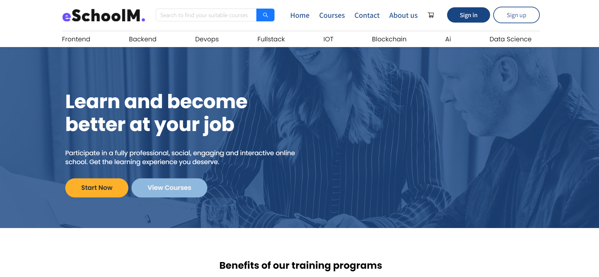
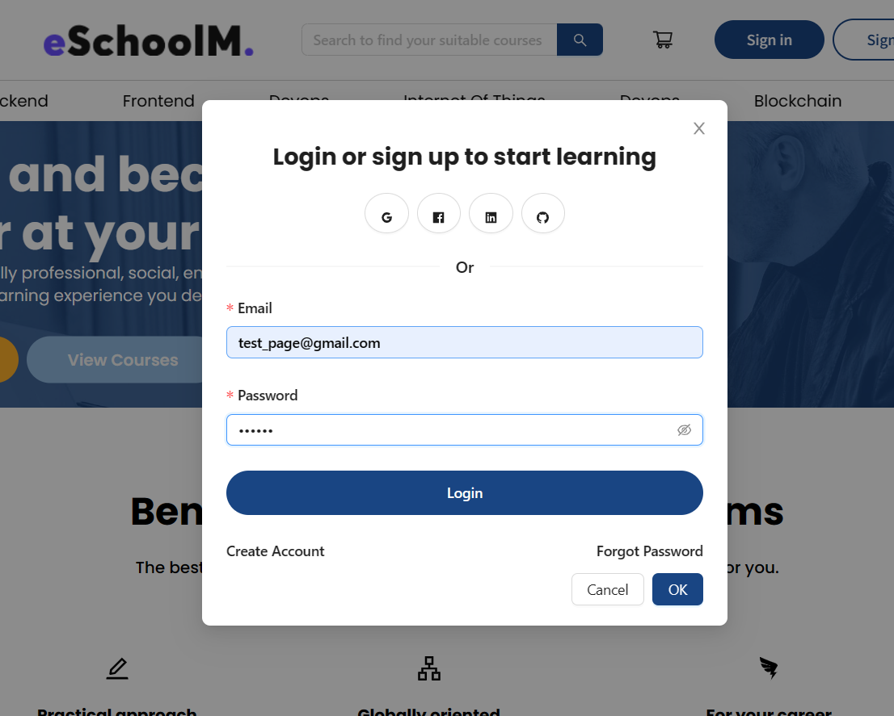
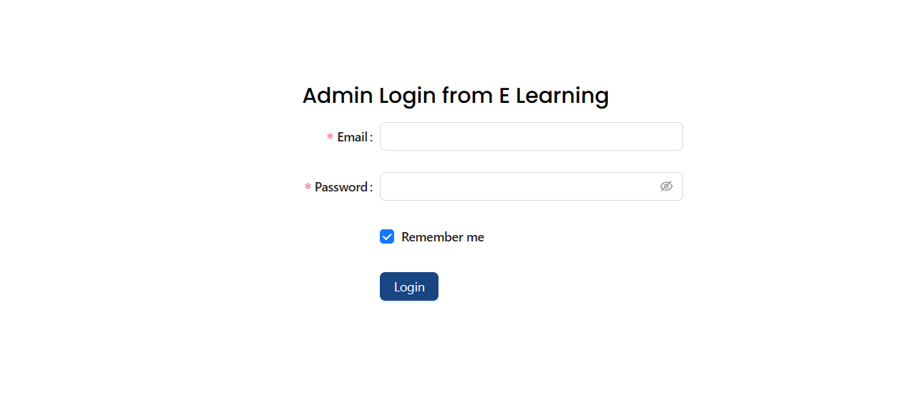
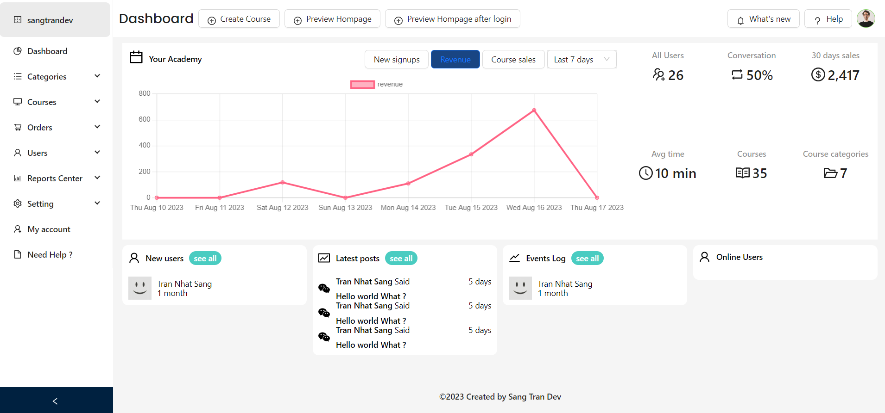

# FRONTEND: E LEARNING PLATFORM
<!-- 

[{width=480px height=360px}](https://www.youtube.com/watch?v=VIDEO_ID) -->

This Image of Homepage of E Learnning Platform

<!-- <iframe width="480" height="360" src="https://www.youtube.com/embed/gyMwXuJrbJQ" frameborder="0" allowfullscreen></iframe> -->

## 1. Project Description Overview: 
+ Develop a comprehensive e-learning platform that
serves as a marketplace for selling online courses.
+ Our platform
offers a seamless experience for users to browse and purchase courses, study the course materials, and track their progress. 
+ The administrator has the ability to manage orders and analyze student performance
+ Take a look to visit the website: 
https://e-learning-platform.pro

## 2. Main Module features

### 2.1 Authentication feature: 
+ Using JWT authenticate for both user and admin site
+ Users can signup 
   - After signup, users are able to login (with username and password have created at website)
   - Password using bcrypt algorithm
   - Info to signup: Name, Email, Password, Phone
+ Users are able to login 
  - After login state of website will change.
+ Admin login. After login with (User is authorized to view/manage models base on the current role (USER, TEACHER) )
+ Logout. Both user and admin are able to logout of website. When user or admin logout of website (the state of website will reset from the begining, and it will send a request to backend to excute logout and make JSON WEB TOKEN invalid)
## 2.2 Main core features
### 2.2.1 Before login
#### **2.2.1.1. Client**
- **Header**: With Navigation, help users can navigate over website
- **Footer**: With related links such as about, contact, page introduction and other connection like socials.
- **Menu**: With full categories of website.
- **Homepage**: 
  -  Users are able to see overview about website with slogan, banner, benefits, statistic, courses by categories (Popular, Frontend, Backend, Devops Courses) at website
  -  Each Section show 4 course items, and view more button, which make section load x2 number of items.
    - At banner user can click to view courses, start now to open login modal
    - When not logined, user when click to the button (Enroll/ Buy now) it will force user to login first then continue.
    - Load more to views at each categories section.
    - When click at title and thumbnail of course it will go to course detail
- **Course Detail**:
  - View detail for every course with
  - Infomation of course detail:
    -  Course name
    -  Numbers of Ratings
    - Average stars
    -  Last updated
    -  Thumbnail
    -  Number of students
    -  Course Price / Free
    -  Buttons: Enroll now/Add to cart/ Buy now.
    -  Course includes (total videos length, number of sections, lessons)
    -  Contents will learn
    -  And layout sections of the course with numbers lessons, videos, minutes,...
    -  Each section of course content have:
       - Section name
       - Number of lesson
       - Total hours of that section  
       - lessons follow by section.
    - Each lesson have info:
      - Lesson name
      - Total video lengths of that lesson 
    - Course's author information: with name and avatar.
  - User can add to cart (the course). Go to View Cart
- **Courses Page**:
    - Users are able to views all the courses of website
    - Users can search for courses. This feature, I applied full-text search with nodejs and mongoodb. If course's name or description includes the word in "search terms" it will be displayed.
    - Users can filter buy author name, level, price, topic. (All this feature i used logic at backend using nodejs)
    - Users can sort for buying newest courses.
    - Paginate the courses. With 12 coures per each page.
    - >Note: The Information of Course component, which shows at Homepage and Courses page is:
      + The thumbnail
      + Course name
      + Course Description
      + Buttons: Enroll/Buynow
      + Price of course/ Free
      + Author avatar and author's name
      + Badge

- **View Cart**: 
  - User can add to cart without login at website. The Cart will store at localStorage, persist the state even if user close browser.
  -  At cart page, user can remove cart, view briefly information of course, total price of cart, number of courses have added, continute to checkout (if logined).
- **Other pages**: Contact, About page
#### 2.2.1.2. Admin Pages:
    **Only show admin login page when not logged in**
### 2.2.2 After login:

#### How to login at Client ?
#### Step 1: Click Sign in Button

#### Step 2: Enter email and password:
+ Email: test_page@gmail.com
+ Password: 123456

#### 2.2.2.1 Client (Add more features when logined)
- **Header**: Show information of user (with avatar, username, email )
- **Homepage**: 
  - Change state of website. Show my courses (the courses have ordered of users)
  - Users are able to buy courses, enroll (if free) when logined.
  - After enrolled to go to subcribe course and create an order at database. 
  - After click to buy now to go checkout page, and continute to check and create order.
  - If that course's already bought buy user, the course item will show (Go to Course) Button. Let the user navigate to Study Watch Video Place.
-  **Course Detail**: 
   -  Users are able to buy now, enroll if free.
   -  Go to course study place if already bought.
- **My Learning Place**: (React Player)
  - Users are able to view all of courses have ordered before
  - See overview of number of courses, total hours of video have watch/done.
  - Click to course item to go to course study place (watch video)
- **View Profile of user**:
  - View Profile of user with total course have ordered, total hours of videos have done, info name. 
- **Course Study Place**: 
    - Users are able to track current progress of user'course
    - Watch video, complete video
    - After complete 100% course's lessons, Users are able to get certificates of course (with PDF file have name, date finished, course name)
#### 2.2.2.2 Admin

#### How to login ?
#### Step 1: Go to Website
https://e-learning-platform.pro/author-login
#### Step 2: Login with Admin author (contact me to get the account)

#### Step 3: Enjoy with admin dashboard and other features.

E learning dashboard overview

- **Dashboard**: 
  - View overall reports at the website (with total sales for 30 days, all users, all courses, all categories),
  -  view new singups, revenue, course sales for (7/30/60 days ago)
- **Categories**: 
  - Manage categories with list categories by table format have pagination 
  - Create/edit/delete category
  - Search category by name, filter category by category name 
- **Courses**:
  - Manage courses with list courses by table format and grid format have pagination 
  - Create/delete course 
  - After creating a course, admin is able to add section and lessons for course
  - Lesson type is youtube video format.
  - Search course by name (full-text search)
  - Filter course by categories, author's name
- **Users**:
  - Manage users with list users by table format, have pagination 
  - Create/edit/delete user, 
  - Search user by name (full-text search)
- **Orders**:
  - Manage orders with list orders by table format, have pagination.
  - View the overall of each orders includes total revenue of website, total number of sales, total amounts of each orders, numbers of courses, date ordered
  - Search order by user's name
  - Filter orders by course, buy previous date ordered (7 days, 30 days, yesterday, today).

- **Reports Centers**:
  - ** User Progress**:
    - List users's insight with total study time of users for all courses, total courses have ordered, in completed course  
  - ** Course Insight**:  
    - List course's insight with total of learners, average study times of students per all students of this course, total videos durations, and all lessons of the course.
- **Authorization**:
  - Website author with 2 main role (ADMIN - TEACHER)
  - Admin with full control of permissions
  - Teachers are able to view courses of themselves, create/edit/ delete courses of themselves, View categories, not able to edit or delete
## 3. Technologies in use:
+ Languages: HTML, CSS, SCSS
+ Responsive Web Design 
+ Framework/libraries: React Typescript, Redux, RTK Query, Ant Design
+ Build tool: Vitejs

## 4. Related Links:
+ Backend Repository Link: [backend repository link here](https://github.com/sangtrandev00/backend-course-prj)
+ Author's Person Website: https://trannhatsang.com

## 5. License
+ Author: Tran Nhat Sang
+ Website: https://trannhatsang.com
+ Email: nhatsang0101@gmail.com
+ Contact me everytime!